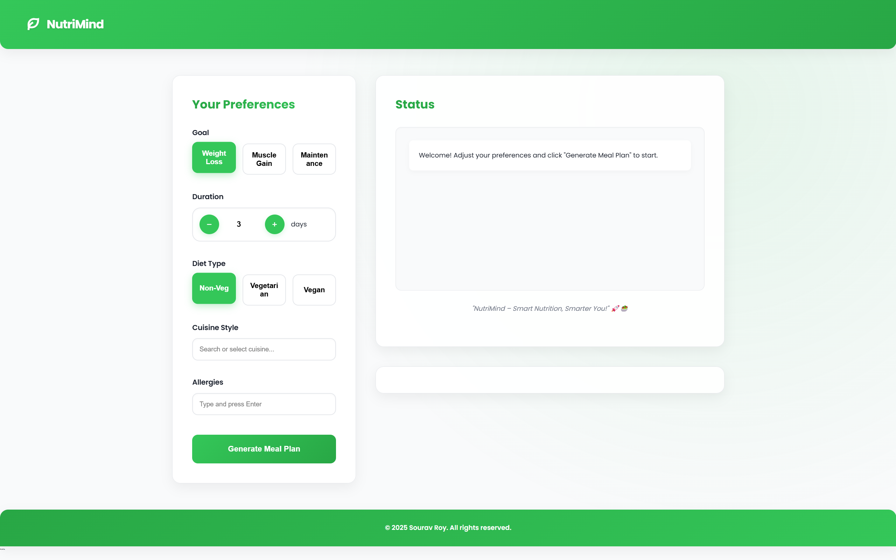
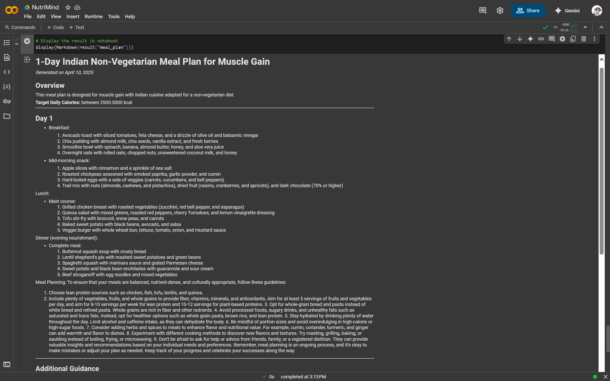

# NutriMind

NutriMind is a project designed to help users track and improve their nutritional habits. This repository contains the source code and documentation for the NutriMind application.

## Features

- Track daily meals and nutritional intake.
- Set and monitor health goals.
- Generate personalized diet recommendations.
- Visualize progress with charts and reports.

## Screenshots

### User Interface


### Generated Meal Plan Output


## Meal Plan Output

You can view the detailed meal plan [here](./assets/meal_plan.md).

## Installation

1. Clone the repository:
    ```bash
    git clone https://github.com/heysouravroy/NutriMind.git
    ```
2. Navigate to the project directory:
    ```bash
    cd NutriMind
    ```
3. Install dependencies:
    ```bash
    npm install
    ```
4. Start the application:
    ```bash
    npm start
    ```

## Usage

1. Open the application in your browser at `http://localhost:3000`.
2. Create an account or log in.
3. Start tracking your meals and goals.

## Contributing

Contributions are welcome! Please follow these steps:

1. Fork the repository.
2. Create a new branch:
    ```bash
    git checkout -b feature-name
    ```
3. Commit your changes:
    ```bash
    git commit -m "Add feature-name"
    ```
4. Push to your branch:
    ```bash
    git push origin feature-name
    ```
5. Open a pull request.

## License

This project is licensed under the MIT License. See the [LICENSE](LICENSE) file for details.

## Contact

For questions or feedback, please contact [heysouravroy](https://github.com/heysouravroy).
